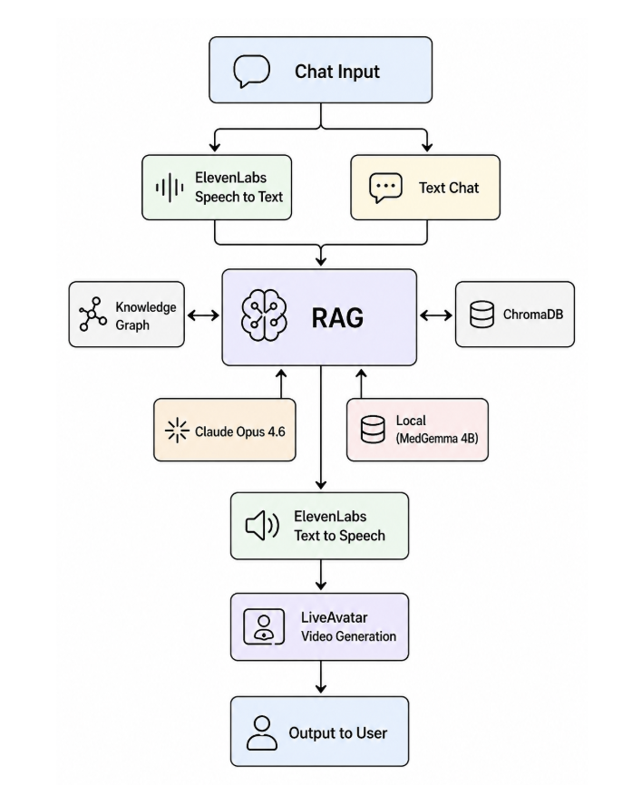

# AI4HC Capstone — ER Simulator Showcase Poster

> Healthcare AI training simulator, built by a 6-person team capstone. My role was the showcase poster + the avatar source footage. University of Arizona, INFO 698, Spring 2026.

**Team codebase:** [UA-AICore/Emergency-Room-Simulator-Repository](https://github.com/UA-AICore/Emergency-Room-Simulator-Repository)

The poster source and build pipeline I authored are in this folder.

---

## What This Was

A 6-person team capstone for the UofA AI Core, building an AI-powered training simulator for emergency-room learners. The team product is a .NET 8 web app with a RAG-backed chat tutor over a medical knowledge base, a HeyGen streaming avatar, and a multiple-choice quiz generator.

I wasn't on the engineering side. My job on this team was design and the avatar source.

---

## My Contributions

**1. The showcase poster.**

- Solo-designed and built the team's capstone poster
- HTML/CSS source so we could iterate in a browser; exported to a 4×3 ft print-ready PDF via [`scripts/export_poster.py`](./scripts/export_poster.py) — a Python pipeline I wrote that renders the HTML in headless Chrome at 4608×3456 px, screenshots it, and embeds the PNG losslessly into a 48×36 in PDF with print-shop metadata
- The team printed from this PDF for the iShowcase event and the physical poster came out matching the on-screen render exactly
- Two variants: a light version for the project slide demo, a dark version for the printed banner
- Summarizes the team's system in one visual: the RAG pipeline, the avatar integration, the quiz engine, the learner flow
- View: open [`index_v1.html`](./index_v1.html) in a browser, or [`iShowcase_Final.pdf`](./iShowcase_Final.pdf) for the print version. The source files in this folder are the actual files I authored.

**2. Avatar source footage.**

- Recorded the 1-minute source clip of myself for the team's HeyGen avatar
- Handed the footage to the project coordinator, who handled the HeyGen API wiring
- I didn't write that integration code; my contribution was being the source

That's it. The codebase, the RAG service, the API integration, the quiz engine — all teammate work.

---

## Files in This Folder

| File | What it is |
| --- | --- |
| [`index_v1.html`](./index_v1.html) | The poster source (unified version). Open in a browser to render it as the team displayed it. |
| [`index_dark.html`](./index_dark.html) | Earlier dark-theme variant of the poster source. |
| [`iShowcase_Final.pdf`](./iShowcase_Final.pdf) | The final printed showcase poster (3.2 MB). |
| [`AI4HC_poster_dark.pdf`](./AI4HC_poster_dark.pdf) | Dark-theme variant of the print PDF (3.6 MB). |
| [`scripts/export_poster.py`](./scripts/export_poster.py) | Python pipeline that renders the HTML to a 48×36 in print-ready PDF via headless Chrome + img2pdf. |
| [`system_workflow.png`](./system_workflow.png) | System architecture diagram embedded in the poster. |
| [`qr-final-codira.png`](./qr-final-codira.png) | QR code from the poster (links out to the live demo). |
| [`UA_logo.svg`](./UA_logo.svg) | UA branding asset used in the poster header (referenced by both HTML variants). |

---

## What I Didn't Build

To be explicit: the .NET web app, the RAG service backed by the medical knowledge base, the HeyGen streaming avatar integration, and the multiple-choice quiz engine were all built by the engineering members of the team (Ameya, hginman, hcp62, and others). My only contribution to the codebase side was the avatar source recording. The poster and its build pipeline are mine; the rest isn't.

---

## Tech Stack

HTML • CSS • Python (headless Chrome → img2pdf print pipeline) • Information design • Technical communication
