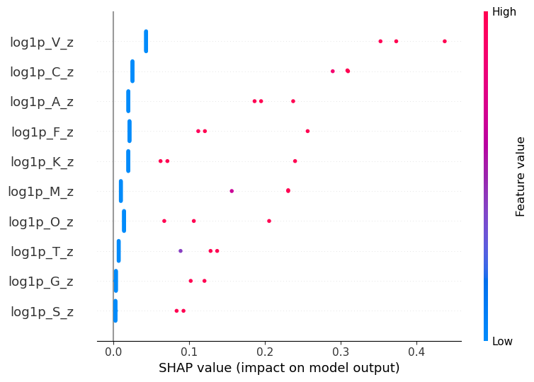
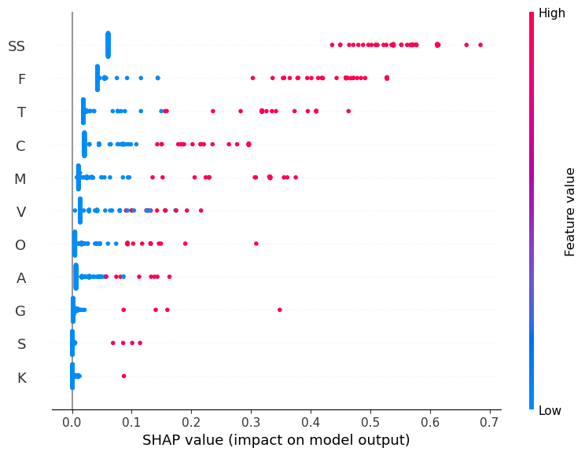

# Trait-Based Prediction of Animal Taxa

[](https://info-523-su25.github.io/final-project-thompson/)
[](https://datamineaz.org/)
[](https://arizona.edu)


> **ML classification project using sexually selected traits to predict animal taxonomy** — University of Arizona, INFO 523

**[View Live Website](https://info-523-su25.github.io/final-project-thompson/)** | **[Analysis Notebook](./index.ipynb)**

---

## Research Question

**Can sexually selected traits predict higher-level taxonomic groups (superphyla), and which traits matter most?**

I compared binary presence/absence data vs. evolutionary origin rates across 1,087 animal families to determine which data representation works best for taxonomic classification.

---

## Results Preview

### Class Distribution

<p align="center">
  
</p>

_Dataset has 1,087 animal families across 5 superphyla — class imbalance required balanced metrics._

### SHAP Feature Importance

Comparing which traits predict taxonomy using two different data representations:

|                Evolutionary Rates (Better)                |                Binary Presence/Absence                 |
| :-------------------------------------------------------: | :----------------------------------------------------: |
|  |  |
|    Visual (V), Competition (C), Auditory (A) strongest    |               Sparse data = weak signal                |

_Evolutionary rates provided clearer feature importance than binary presence/absence data._

---

## What I Applied

I built machine learning classification models using real biological data. Here's what I accomplished:

| Finding                              | Detail                                                                                      |
| ------------------------------------ | ------------------------------------------------------------------------------------------- |
| **Evolutionary rates > Binary data** | Continuous origin rates provided a stronger signal than sparse binary presence/absence data |
| **Modest accuracy (~50%)**           | The classification task was challenging due to data sparsity and class imbalance            |
| **Key predictors**                   | Visual, Competition, and Auditory traits (identified via SHAP analysis)                     |
| **Class imbalance matters**          | Used balanced accuracy and macro F1 instead of regular accuracy                             |

### Models Tested

| Model                   | Data Type          | Result                     |
| ----------------------- | ------------------ | -------------------------- |
| **Logistic Regression** | Evolutionary rates | Best performance           |
| Random Forest           | Evolutionary rates | Lower accuracy             |
| Decision Tree           | Evolutionary rates | Lower but interpretable    |
| All models              | Binary data        | Poor (insufficient signal) |

---

## Technical Skills Applied

**Machine Learning Pipeline**

1. Preprocessing: Implemented missing value handling, feature scaling, and label encoding
2. Cross-validation: Applied stratified K-fold to handle class imbalance
3. Model training: Trained Logistic Regression, Decision Trees, and Random Forest models
4. Explainability: Used SHAP values to interpret feature importance and identify key predictors
5. Evaluation: Implemented balanced accuracy and macro F1 metrics for imbalanced classification

**Concepts Applied**

- Implemented imbalanced classification with balanced metrics
- Applied model explainability with SHAP
- Performed domain-driven feature engineering (grouping phyla into superphyla)
- Created reproducible research with Quarto

---

## Dataset

| File                                                                  | Records        | Description                   |
| --------------------------------------------------------------------- | -------------- | ----------------------------- |
| [`family_related_data.csv`](./data/family_related_data.csv)           | 1,087 families | Binary trait presence/absence |
| [`animals_rateof_evolution.csv`](./data/animals_rateof_evolution.csv) | 84 estimates   | Evolutionary origin rates     |

**Traits analyzed**: Auditory (A), Gustatory (G), Olfactory (O), Tactile (T), Visual (V), Male competition (C), Female competition (K), Intersexual conflict (S), Female choice (F), Male choice (M)

**Classification target**: 5 superphyla — Ecdysozoa, Lophotrochozoa, Deuterostomia, Basal Metazoa, Basal Bilateria

Full codebook: [`data/README.md`](./data/README.md)

---

## Key Findings

**Data Representation Matters**: Evolutionary origin rates provided a much stronger predictive signal than binary presence/absence data. This finding demonstrates the importance of domain knowledge in feature engineering.

**Top Predictors**: SHAP analysis identified Visual (V), Competition (C), and Auditory (A) traits as the strongest predictors of taxonomic classification across 1,087 animal families.

**Model Performance**: Logistic Regression outperformed tree-based models (Random Forest, Decision Tree) for this biological dataset, achieving the best balance of accuracy and interpretability.

**Class Imbalance Challenge**: The dataset's imbalanced distribution across 5 superphyla required balanced accuracy and macro F1 metrics rather than standard accuracy to properly evaluate model performance.

---

## Project Structure

```
data-mining-final-project/
├── README.md                 # This file
├── index.ipynb               # Main analysis notebook (99 cells)
├── requirements.txt          # Python dependencies
├── _quarto.yml               # Website configuration
├── data/
│   ├── family_related_data.csv       # Binary traits (1,087 families)
│   ├── animals_rateof_evolution.csv  # Evolutionary rates (84 estimates)
│   └── README.md                     # Data codebook
├── images/
│   └── Plots/                # Generated visualizations
│       ├── SHAP_evolution.png
│       ├── SHAP_family.png
│       └── ...
├── docs/                     # Generated Quarto website (don't edit)
├── proposal.qmd              # Research proposal
├── presentation.qmd          # Results presentation
└── citations.qmd             # Bibliography
```

---

## Project Resources

| Resource                                                                | Description                                 |
| ----------------------------------------------------------------------- | ------------------------------------------- |
| [Live Website](https://info-523-su25.github.io/final-project-thompson/) | Full interactive analysis and presentation  |
| [Analysis Notebook](./index.ipynb)                                      | Jupyter notebook with all code (99 cells)   |
| [Proposal](./proposal.qmd)                                              | Original research questions and methodology |
| [Presentation](./presentation.qmd)                                      | Key findings and visualizations             |
| [Data Codebook](./data/README.md)                                       | Complete variable descriptions              |

---

## Academic Information

**Course**: INFO 523 - Data Mining & Machine Learning  
**Term**: Summer 2025  
**Institution**: University of Arizona  
**Acknowledgment**: Project template inspired by Mine Çetinkaya-Rundel @ Duke University

---

<p align="center">
  <a href="https://info-523-su25.github.io/final-project-thompson/">View the Full Interactive Analysis</a>
</p>
