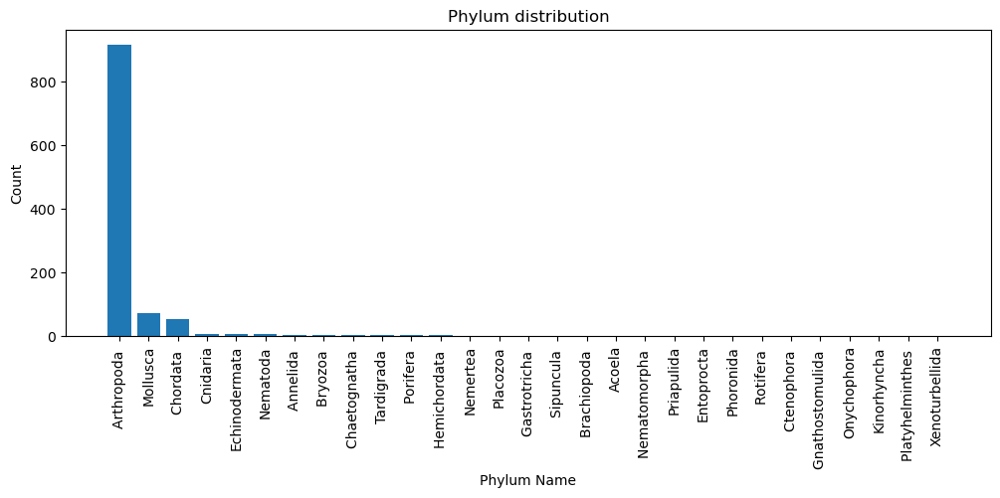
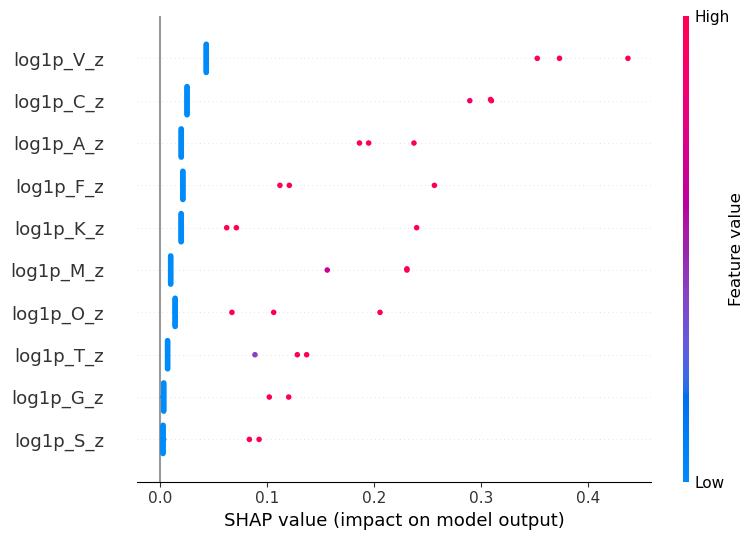
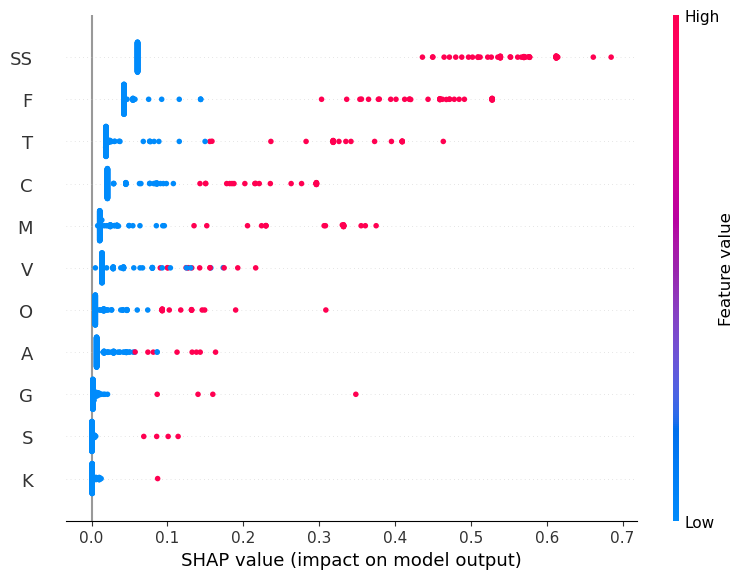

# Trait-Based Prediction of Animal Taxa

[](https://info-523-su25.github.io/final-project-thompson/)
[](https://datamineaz.org/)
[](https://arizona.edu)


> **ML classification project using sexually selected traits to predict animal taxonomy.** University of Arizona, INFO 523

**[View Live Website](https://info-523-su25.github.io/final-project-thompson/)** | **[Analysis Notebook](./index.ipynb)**

---

## Research Question

**Can sexually selected traits predict higher-level taxonomic groups (superphyla), and which traits matter most?**

I compared binary presence/absence data vs. evolutionary origin rates across 1,087 animal families to determine which data representation works best for taxonomic classification.

---

## Results Preview

### Class Distribution

<p align="center">
  
</p>

_Dataset has 1,087 animal families across 5 superphyla. Class imbalance required balanced metrics._

### SHAP Feature Importance

Comparing which traits predict taxonomy using two different data representations:

|                Evolutionary Rates (Better)                |                Binary Presence/Absence                 |
| :-------------------------------------------------------: | :----------------------------------------------------: |
|  |  |
|    Visual (V), Competition (C), Auditory (A) strongest    |               Sparse data = weak signal                |

_Evolutionary rates provided clearer feature importance than binary presence/absence data._

---

## What I Applied

| Category | Techniques |
|---|---|
| **Preprocessing** | Missing value handling, log-transform + standardization of evolutionary rates, label encoding |
| **Cross-validation** | Stratified K-fold to preserve class proportions across folds |
| **Models** | Logistic Regression, Decision Tree, Random Forest |
| **Explainability** | SHAP values for feature importance ranking |
| **Evaluation** | Balanced accuracy, macro F1 (instead of accuracy / ROC-AUC, given the class imbalance) |
| **Feature engineering** | Domain-driven grouping of phyla into 5 superphyla |
| **Reproducibility** | Quarto website (Jupyter notebook + .qmd source → HTML site) |

### Findings

| Finding | Detail |
|---|---|
| **Evolutionary rates > Binary data** | Continuous origin rates provided a stronger signal than sparse binary presence/absence data |
| **Modest accuracy (~50%)** | Classification task was challenging due to data sparsity and class imbalance |
| **Key predictors** | Visual, Competition, and Auditory traits (identified via SHAP analysis) |
| **Class imbalance matters** | Balanced accuracy and macro F1 instead of regular accuracy |

### Models Tested

| Model | Data Type | Result |
|---|---|---|
| **Logistic Regression** | Evolutionary rates | Best performance |
| Random Forest | Evolutionary rates | Lower accuracy |
| Decision Tree | Evolutionary rates | Lower but interpretable |
| All models | Binary data | Poor (insufficient signal) |

---

## Dataset

| File                                                                  | Records        | Description                   |
| --------------------------------------------------------------------- | -------------- | ----------------------------- |
| [`family_related_data.csv`](./data/family_related_data.csv)           | 1,087 families | Binary trait presence/absence |
| [`animals_rateof_evolution.csv`](./data/animals_rateof_evolution.csv) | 84 estimates   | Evolutionary origin rates     |

**Traits analyzed**: Auditory (A), Gustatory (G), Olfactory (O), Tactile (T), Visual (V), Male competition (C), Female competition (K), Intersexual conflict (S), Female choice (F), Male choice (M)

**Classification target**: 5 superphyla (Ecdysozoa, Lophotrochozoa, Deuterostomia, Basal Metazoa, Basal Bilateria)

Full codebook: [`data/README.md`](./data/README.md)

---

## Challenges Solved

The clearest result was that the two datasets behaved very differently. The binary presence/absence data was sparse and dominated by Arthropoda (~84% of samples), and SHAP showed the model leaned almost entirely on a single feature, the "sexually selected" flag. The evolutionary rate data was more balanced, and its signal spread across visual, competition, auditory, and female choice traits. So rate-based features predicted taxonomy better than binary presence, though even the better dataset only reached around 50% accuracy. The signal in this kind of trait data is real but limited.

A lot of the project changed from my original proposal. I had planned to predict at the class/family level, but the data was too sparse, so I grouped phyla into five superphyla instead. I log-transformed and standardized the evolutionary rates rather than binarizing them, and I switched the evaluation metrics to balanced accuracy and macro F1 instead of ROC-AUC, since the classes were so uneven. SHAP also started as a secondary check but became central. It was what showed how heavily the binary model leaned on that one SS flag.

If I did this again, I'd remove the SS traits and redo modeling for the family data, since the model relied on SS so heavily that it masked the other traits. The bigger limitation, though, is data quality: both datasets were too sparse and imbalanced to generalize well, and that would need to improve before this approach could go further.

---

## Project Structure

```text
data-mining-final-project/
├── README.md                          # This file
├── index.ipynb                        # Main analysis notebook (99 cells, 1.2MB)
├── _quarto.yml                        # Quarto website configuration
├── requirements.txt                   # Python dependencies (jupyter, scikit-learn, shap, etc.)
├── proposal.qmd                       # Research proposal
├── presentation.qmd                   # Results presentation
├── data.qmd                           # Dataset description page
├── about.qmd                          # About page
├── citations.qmd                      # Bibliography
├── data/
│   ├── family_related_data.csv        # Binary traits (1,087 families, 50KB)
│   ├── animals_rateof_evolution.csv   # Evolutionary rates (84 estimates, 12KB)
│   └── README.md                      # Data codebook
├── images/
│   ├── Plots/                         # SHAP and EDA plots
│   └── tree_scenery.jpg               # Header image for the site
└── docs/                              # Generated Quarto website (regenerated by `quarto render`)
```

---

## How to Reproduce

Requires Python 3.10+ and [Quarto 1.5+](https://quarto.org/docs/get-started/).

```bash
# 1. Install Python deps
pip install -r requirements.txt

# 2. Render the full website (notebook + .qmd pages → docs/)
quarto render

# Or render just the main analysis notebook
quarto render index.ipynb
```

`quarto render` produces the static site in [`docs/`](./docs/) (the same site published at [info-523-su25.github.io/final-project-thompson/](https://info-523-su25.github.io/final-project-thompson/)). Full render takes ~30 seconds; single-notebook render is ~3 seconds.

---

## Project Resources

| Resource                                                                | Description                                 |
| ----------------------------------------------------------------------- | ------------------------------------------- |
| [Live Website](https://info-523-su25.github.io/final-project-thompson/) | Full interactive analysis and presentation  |
| [Analysis Notebook](./index.ipynb)                                      | Jupyter notebook with all code (99 cells)   |
| [Proposal](./proposal.qmd)                                              | Original research questions and methodology |
| [Presentation](./presentation.qmd)                                      | Key findings and visualizations             |
| [Data Codebook](./data/README.md)                                       | Complete variable descriptions              |

---

## Academic Information

**Course**: INFO 523 - Data Mining & Machine Learning  
**Term**: Summer 2025  
**Institution**: University of Arizona  
**Acknowledgment**: Project template inspired by Mine Çetinkaya-Rundel @ Duke University

---

<p align="center">
  <a href="https://info-523-su25.github.io/final-project-thompson/">View the Full Interactive Analysis</a>
</p>
