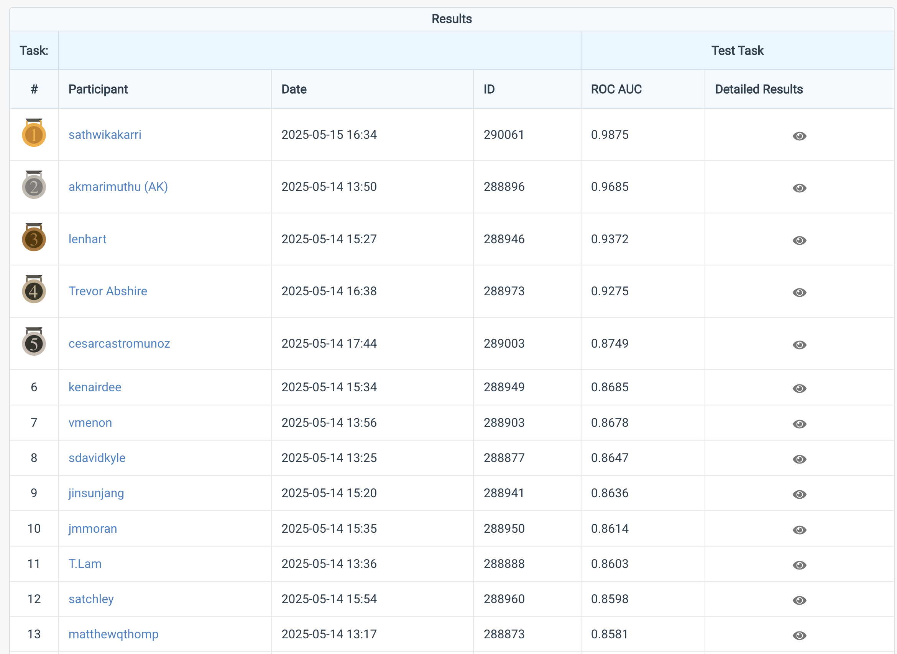

[← Back to Data Science Projects](../README.md)

# Healthcare Readmission Risk Prediction

[](https://www.codabench.org/competitions/6813/)

[](https://arizona.edu)


> **Class competition for predicting 30-day hospital readmissions using synthetic EHR data.** University of Arizona, INFO 511

**Leaderboard**: [CodaBench Competition 6813](https://www.codabench.org/competitions/6813/) (login-gated; CodaBench requires an account to view any competition page). Final rankings and scoring are documented in the Competition Results section below.

---

## Competition Results

**ROC AUC 0.901 model**, 5th/40 in the development phase and 13th/35 on the final held-out test.

| Phase           | Ranking    | ROC AUC | Participants |
| --------------- | ---------- | ------- | ------------ |
| **Development** | 5th place  | 0.9011  | 40           |
| **Testing**     | 13th place | 0.8581  | 35           |



_CodaBench test-phase leaderboard for competition 6813. Username `matthewqthomp` at rank 13 with ROC AUC 0.8581. Top 12 visible; full leaderboard had 35 participants._

My cross-validated AUC (~0.86) predicted the final test AUC (0.858) almost exactly. The model held up on unseen data. The development-phase leaderboard score (0.90) was the optimistic one; the rank moved from 5th to 13th as the field's scores settled on the held-out test.

---

## Project Overview

Final project for INFO 511 (Foundation of Data Science): a CodaBench class competition to predict 30-day hospital readmissions on a Synthea-generated EHR dataset. Submitted model: Random Forest (n_estimators=200, class_weight='balanced').

**Key Metrics**: 587,801 train rows • 125,958 dev rows • 9 algorithms compared • Final test ROC AUC 0.858 (13th/35)

---

## What I Applied

### Feature Engineering

| Decision                       | Reasoning                                                               |
| ------------------------------ | ----------------------------------------------------------------------- |
| **Patient frequency encoding** | Transformed patient_id into encounter count per patient (key predictor) |
| **Dropped zip code**           | Not meaningful without distance calculation                             |
| **Dropped symptom columns**    | All values were identical (0), so uninformative                           |
| **Mean imputation**            | Large sample size made mean imputation appropriate                      |

### Data Quality Challenges

- **Missing data**: Identified and handled significant gaps in medication counts, procedure costs, pain scores, patient height
- **Uninformative features**: Removed symptom columns (chronic pain, hypertension, diabetes, asthma, depression) with identical values

### Model Comparison

Evaluated 9 algorithms: Logistic Regression, Decision Tree, Random Forest, Gradient Boosting, HistGradientBoosting, AdaBoost, ExtraTrees, Bagging, KNeighbors

**Random Forest** provided the best balance of performance and stability for this dataset.

---

## Challenges Solved

The biggest lesson from this project was how much the way data is cleaned and represented affects model performance.

My first idea was to group on `patient_id` to tally each patient's readmissions. It scored around 0.69. I'd focused too much on *who* the patient was rather than the other factors behind a readmission. I redid it, encoding `patient_id` as a frequency count instead of grouping on it, and dropped the columns that weren't informative. That version performed much better.

While checking the model for overfitting, an earlier version returned a perfect 1.0 score with no train/test gap. A perfect score is a warning sign, not a result. It meant data had leaked into the features. I traced it to an aggregation that tallied `readmitted_within_30_days` only where the value was 1, removed that code, and re-validated to a legitimate cross-validation score with a small (~0.04) gap.

---

## Dataset

Synthetic Arizona patient encounter records (Synthea-generated EHR) provided for the INFO 511 class competition. Full data documentation in [`data/README.md`](./data/README.md).

| File | Size | Records | Contents |
|---|---|---|---|
| [`data/train.csv`](./data/train.csv) | 88MB | 587,801 | Training set with features + target |
| [`data/dev.csv`](./data/dev.csv) | 19MB | 125,958 | Development/validation set with target |
| [`data/dev(renamed).csv`](./data/dev\(renamed\).csv) | 19MB | 125,958 | Second dev split snapshot |
| [`data/test.csv`](./data/test.csv) | 19MB | features only | Held-out test set |
| [`data/submission.csv`](./data/submission.csv) | 7MB | predictions | Final submission scored on the leaderboard |

Target variable: `readmitted_within_30_days` (binary).

---

## Project Structure

```text
foundation-of-data-science/
├── README.md                           # Project documentation
├── requirements.txt                    # Python dependencies (pandas, scikit-learn, joblib, numpy, datasets)
├── final_project_process.ipynb         # Main analysis notebook (1,272 lines)
├── final_project_process.md            # Markdown export of the notebook (browser-friendly)
├── ds.py                               # Core data science utilities (4.8KB)
├── train_predict.py                    # Model training + prediction CLI (6.7KB)
├── data/
│   ├── train.csv                       # Training dataset (587,801 records)
│   ├── dev.csv                         # Development/validation set (125,958 records)
│   ├── dev(renamed).csv                # Second dev split snapshot
│   ├── test.csv                        # Test dataset (features only)
│   ├── submission.csv                  # Final predictions
│   └── README.md                       # Data documentation
└── scripts/
    ├── scoring/                        # Competition evaluation scripts (CodaBench scoring)
    └── scoring_dev/                    # Development scoring tools
```

---

## How to Reproduce

Requires Python 3.9+.

```bash
# 1. Install deps
pip install -r requirements.txt

# 2. Train on train.csv, evaluate on dev.csv, save the trained model
python train_predict.py train \
  --train_path data/train.csv \
  --dev_path data/dev.csv \
  --model_path model.joblib

# 3. Predict on the held-out test set
python train_predict.py predict \
  --model_path model.joblib \
  --input_path data/test.csv \
  --output_path data/submission.csv
```

Full step-by-step EDA, feature engineering, and model selection is in [`final_project_process.ipynb`](./final_project_process.ipynb). A browser-readable markdown export is at [`final_project_process.md`](./final_project_process.md).

---

## Academic Information

**Course**: INFO 511 - Foundation of Data Science  
**Term**: 2024-2025  
**Institution**: University of Arizona  
**Competition**: CodaBench Healthcare Equity Explorer

---

<p align="center">
  <em>University of Arizona, Data Science Portfolio</em>
</p>
