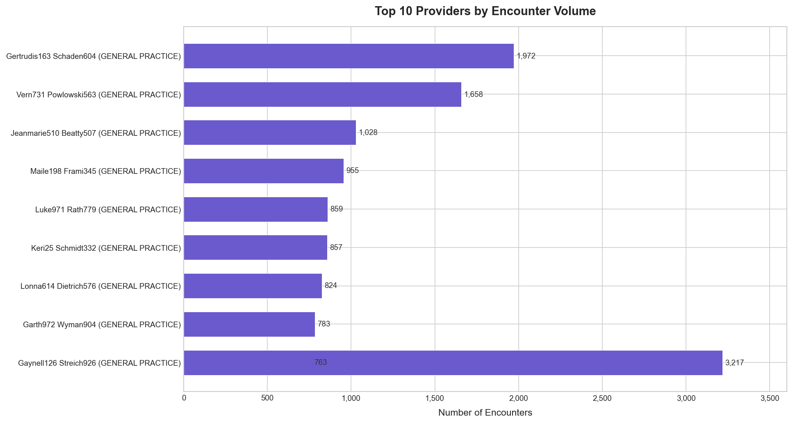
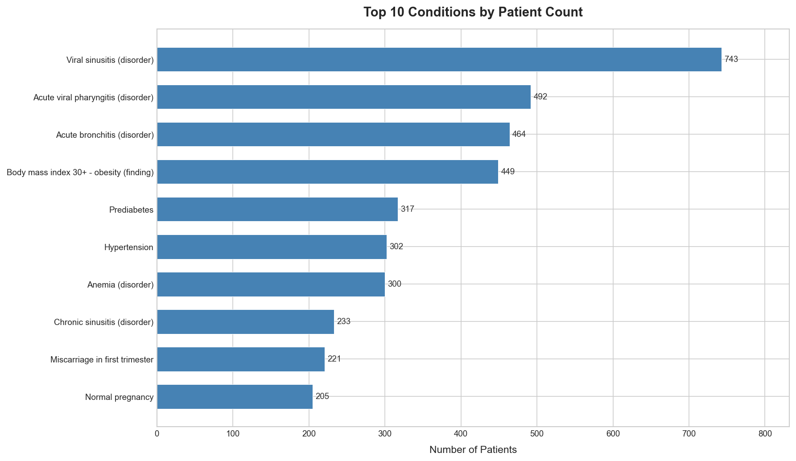
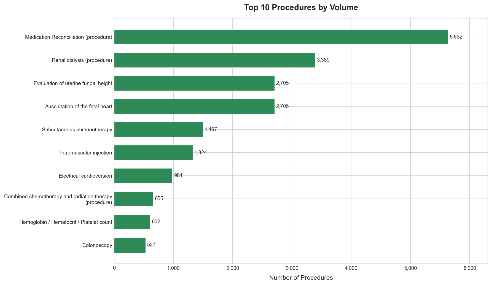
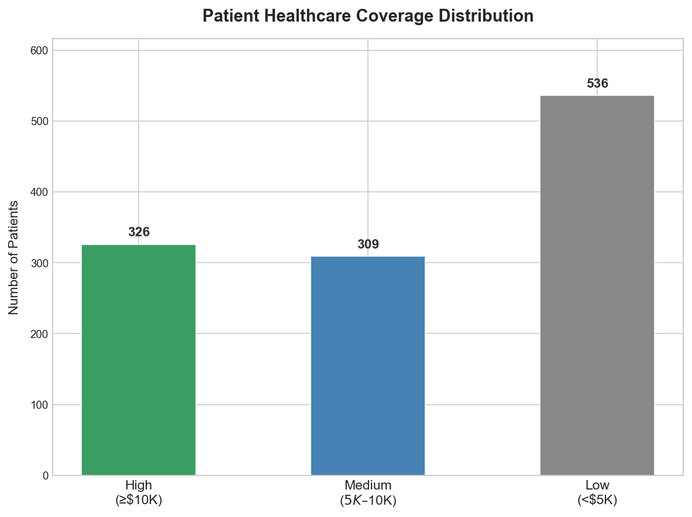
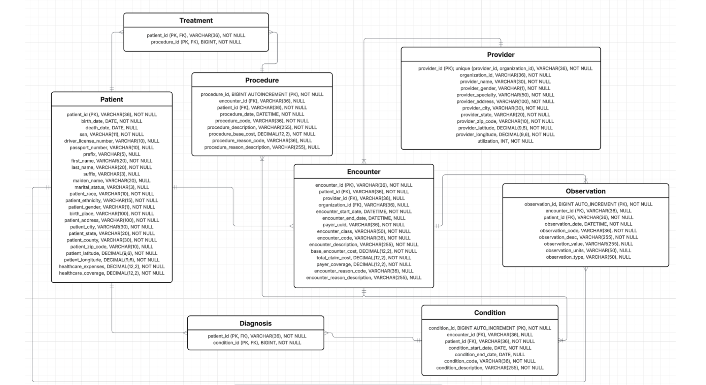

[← Back to Database Systems Projects](../README.md)

# Healthcare Analytics with SQL


Built a normalized MySQL warehouse from ~65MB of synthetic EHR data (1,171 patients, 53,346 encounters) and wrote the SQL to answer operational questions a health system actually asks: which providers are overloaded, which patients are highest risk, and whether the standard metrics even measure the right thing.

**[View the full report (PDF)](./reports/INFO579-Final-Project-Report-Thompson.pdf)** (8.1MB)

---

## What the analysis surfaced

- **A provider workload imbalance.** One General Practice provider handled 3,217 encounters, over 60% more than the next busiest, and all of the top 10 by volume were General Practice. That is a staffing signal worth putting in front of management.
- **A misleading mortality metric, corrected.** A raw death-rate-by-visit-type ranked routine, scheduled visits highest. Recomputed as 30-day mortality per 1,000 encounters, emergency and inpatient care rose to the top, which actually reflects risk.
- **A data-integrity problem caught at load time.** About 10.13% of observation rows referenced encounter IDs that did not exist in the encounter table. The loader caught every one instead of silently corrupting the joins downstream.



---

## Skills applied

| Category              | Techniques                                                            |
| --------------------- | --------------------------------------------------------------------- |
| **Joins**             | Multi-table joins (up to 3 tables, incl. compound-key), LEFT / INNER   |
| **Temporal analysis** | `DATE_ADD` (14-day follow-up window), `TIMESTAMPDIFF` (inpatient LOS)  |
| **Advanced queries**  | CTEs (Common Table Expressions), correlated subqueries                |
| **Aggregation**       | `GROUP BY` + `HAVING`, `CASE` for categorization                      |
| **ETL**               | Batched parameterized `INSERT` (`executemany`), Pandas preprocessing   |
| **Schema design**     | 3NF over 8 base tables + 2 junction tables, 12 foreign-key constraints |

The reporting logic lives in SQL rather than a pandas script on purpose: it sits next to the data, stays reproducible, and can be handed to anyone who reads SQL. Normalizing the denormalized Synthea export to 3NF removed the repeated patient/provider/encounter attributes that make update anomalies inevitable and analytical queries slow.

---

## Business objectives and findings

The project answered five business questions, each with its own report:

| Objective                | Key finding                                                                                       |
| ------------------------ | ------------------------------------------------------------------------------------------------- |
| **Profitability**        | Top patient costs reached $1.1M; medication reconciliation and renal dialysis were most common    |
| **Clinical quality**     | Viral sinusitis most prevalent (63%); emergency 30-day mortality 3.57 per 1,000 encounters        |
| **Provider utilization** | Severe workload imbalance (top provider 3,000+ encounters vs. under 2,000 for the rest)           |
| **Readmissions**         | Flagged high-risk ER patients (3+ visits) for intervention                                        |
| **Expansion**            | Identified 5 inactive specialties for reallocation                                                |

<details>
<summary>Sample charts from the populated database</summary>

**Top conditions by patient count**



Viral upper-respiratory infections lead, followed by cardiometabolic findings (BMI 30+, prediabetes, hypertension). Pregnancy-related conditions appear in the bottom half.

**Top procedures by volume**



Medication Reconciliation leads at 5,632 occurrences. The top procedures are non-surgical: medication management, renal dialysis, obstetric monitoring, immunotherapy, intramuscular injection.

**Patient coverage distribution**



Of 1,171 patients, 326 are high-coverage (>=$10K), 309 medium ($5K to $10K), and 536 low (<$5K). Roughly 46% have low healthcare coverage.

</details>

---

## The data model

The 8 base tables and their foreign-key relationships:



`diagnosis` and `treatment` are junction tables for the many-to-many relationships (patient to medical_condition, patient to procedures). In the diagram, `Condition` and `Procedure` are shortened labels for the SQL tables `medical_condition` and `procedures`.

**Source data: 6 Synthea entities, ~65MB, 446,783 rows loaded across 8 tables.**

| Entity           | File                                          | Size  | Records | Description               |
| ---------------- | --------------------------------------------- | ----- | ------- | ------------------------- |
| **Patients**     | [`patients.csv`](./data/patients.csv)         | 325KB | 1,171   | Demographics, addresses   |
| **Encounters**   | [`encounters.csv`](./data/encounters.csv)     | 16MB  | 53,346  | Medical visits, billing   |
| **Conditions**   | [`conditions.csv`](./data/conditions.csv)     | 1MB   | 8,376   | SNOMED-CT diagnoses       |
| **Procedures**   | [`procedures.csv`](./data/procedures.csv)     | 5.7MB | 34,981  | SNOMED-CT procedure codes |
| **Observations** | [`observations.csv`](./data/observations.csv) | 43MB  | 299,697 | LOINC lab results, vitals |
| **Providers**    | [`providers.csv`](./data/providers.csv)       | 1MB   | 5,855   | Facilities, practitioners |

---

## Engineering notes

**Loading 446K rows across 8 tables.** The loader uses batched `executemany()` inserts (1,000 rows per call) rather than row by row, with a fallback: if a batch hits a foreign-key error, it retries that batch row by row so the valid rows still land and only the bad references are skipped and counted. Loads are foreign-key ordered, and re-runs are safe because each table is truncated and reloaded (idempotent).

**Dirty foreign-key data (10.13% orphan observations).** A `LEFT JOIN` orphan check against the encounter table showed that about 10.13% of observation rows referenced an `encounter_id` with no matching encounter. That count itself became a data-quality finding worth reporting. On load, because `observation.encounter_id` carries a real foreign-key constraint, those rows raise integrity errors, and the loader's row-by-row fallback catches, skips, and counts each one, so the load finishes with clean referential integrity instead of aborting or storing dangling references. The pure-SQL version of this taught in the course does the same job by staging the CSV with `LOAD DATA INFILE` and then `INSERT ... SELECT` with a `LEFT JOIN`, so unmatched keys land as visible NULLs; I rebuilt it as a Python loader here so the whole pipeline reproduces with one command.

**A provider key that actually holds.** The provider data had repeated `organization_id` values, so the encounter-to-provider relationship uses a composite foreign key on `(provider_id, organization_id)` rather than either column alone.

**A metric that was measuring the wrong thing.** A death-rate-by-encounter-class metric first ranked ambulatory, wellness, and outpatient highest. Those are usually scheduled visits, so a raw count there was not a meaningful measure of risk. Recomputing it as death within 30 days of a visit, per 1,000 encounters, moved emergency and inpatient to the top, which made sense.

---

<details>
<summary>Reproduce it (Docker, one command)</summary>

Prerequisites: Docker Desktop or OrbStack, Python 3.9+.

```bash
./setup.sh
```

Runtime ~30s. Populates `Final_Project` on `127.0.0.1:13306` (port 13306 avoids collision with a local MySQL install; 33060 is avoided because OrbStack wraps it as MySQL X Protocol).

```bash
# connect
docker compose exec mysql mysql -u root -pportfolio_demo_pw Final_Project
# stop (data persists)
docker compose down
# reset (deletes volume)
docker compose down -v
```

**Without Docker** (MySQL 8+ and Python 3.9+ local):

```bash
pip install -r requirements.txt
mysql -u root -p -e "CREATE DATABASE Final_Project;"
mysql -u root -p Final_Project < sql/00_schema.sql
python scripts/load_csvs.py --user root --database Final_Project
for f in sql/analytical_reports/*.sql; do mysql -u root -p Final_Project < "$f"; done
```

Loader details: column-name mapping between Synthea CSVs and the schema, ISO-8601 datetime conversion, NULL handling for empty cells, foreign-key load ordering, 1,000-row batches, idempotent re-runs. Password comes from `$MYSQL_PASSWORD` or an interactive prompt.

</details>

<details>
<summary>Repo structure and query index</summary>

```text
sql-nosql-databases-info579/
├── docker-compose.yml        # MySQL 8 container, auto-applies schema
├── setup.sh                  # one-command reproduction
├── scripts/
│   ├── load_csvs.py          # Synthea CSV -> MySQL loader (8 tables, FK-ordered, batched)
│   └── generate_charts.py    # regenerates the analytical chart PNGs
├── data/                     # 6 healthcare CSVs (~65MB)
├── sql/
│   ├── 00_schema.sql         # 3NF schema: 8 base tables + rpt_ tables + FK constraints
│   ├── analytical_reports/   # the 6 business-question reports (Section 7)
│   └── sql_skill_demos/      # 9 SQL skill demonstrations (Section 8)
└── reports/                  # final report PDF + methodology excerpt
```

**Queries by section:**
- [Section 7: 6 analytical reports](./sql/analytical_reports/)
- [Section 8: 9 SQL skill demonstrations](./sql/sql_skill_demos/)
- [Schema definition](./sql/00_schema.sql)

**Reports vs. report tables (the counts measure different things):** The **6 analytical reports** are the six business-question reports in Section 7, all reproduced by `setup.sh`. Separately, the schema declares **14 `rpt_` tables**, of which 9 have a populating query in this repo (5 from the Section 7 reports, since report 7.3 returns a ranked result set rather than a table, plus 4 from the Section 8 skill demonstrations) and 5 are schema-only stubs declared for completeness. So: 6 reports (report unit); 14 declared / 9 populated / 5 schema-only (table unit).

</details>

---

<sub>Graduate project, INFO 579 (SQL & NoSQL Databases), University of Arizona.</sub>
