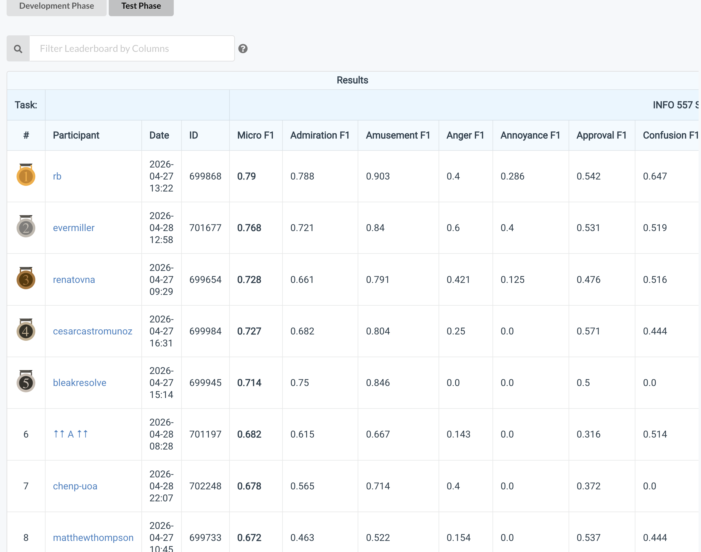

[← Back to Deep Learning Projects](../README.md)

# Multi-Label Emotion Classification with Transformer Fine-Tuning


Multi-label emotion classification on Reddit text, a 14-class subset of GoEmotions, where a single message can carry more than one emotion label.

**Leaderboard**: [CodaBench Competition 13676](https://www.codabench.org/competitions/13676/) (login required). Final ranking and per-class results are documented below.

---

## Competition Results

I finished **8th of 15** on the final test leaderboard with F1 0.672, up from 10th of 18 on dev. The dev-to-test drop was 5 points, the third smallest on the whole board.

| Phase        | Rank  | Micro F1 | Notes                                             |
| ------------ | ----- | -------- | -------------------------------------------------- |
| Development  | 10/18 | 0.7218   | from-scratch CNN, course-techniques-only           |
| Test (final) | 8/15  | 0.672    | 0.050 dev-to-test gap, third smallest on the board |



_CodaBench test-phase leaderboard for competition 13676. Username `matthewthompson` at rank 8 with Micro F1 0.672. Top 7 visible; full leaderboard had 15 participants._

The two people who topped the dev leaderboard (0.923 and 0.826) both didn't submit on test, which I read as evidence they overfit hard to dev. The person who took 1st on test had a near-zero dev-to-test gap. That's basically the story of the project: I traded a couple of dev F1 points for calibration that held up.

---

## Skills applied

| Category | Techniques |
| --- | --- |
| **Architecture** | Conv1D (kernel-sweep selected), GaussianNoise regularization, SpatialDropout1D, GlobalMaxPooling1D |
| **Ensembling** | 5-seed model averaging to stabilize single-seed variance (~10 F1 points) |
| **Loss / calibration** | BCE + label smoothing, output bias from class priors, untuned 0.5 threshold to avoid dev-leakage |
| **Data augmentation** | In-class word swap (Wei & Zou 2019 EDA), targeted duplication on rare classes |
| **Honest evaluation** | Checkpoint-reload inference pipeline (`check.py`) run separately from training-time logs |
| **Transfer learning (post-grading)** | Fine-tuning DistilBERT, bert_tiny, and RoBERTa-base with Hugging Face `transformers` |

---

## Project Overview

The challenge was multi-label emotion classification on a 14-class subset of GoEmotions, with Reddit text inputs at roughly 30 tokens per example.

The course constraint was that during the competition, no pretrained embeddings were allowed, just random-init word embeddings and Keras-buildable architectures.

My final submitted model:

```
Embedding(vocab=10000, dim=128)
  -> GaussianNoise(stddev=0.009)
  -> Conv1D(filters=254, kernel=3, relu)
  -> SpatialDropout1D(0.3)
  -> GlobalMaxPooling1D
  -> Dense(14, sigmoid, bias_init=class_priors_logit)
```

I trained 5 seeds (42 through 46) and averaged their predictions. Binary cross-entropy with 0.05 label smoothing. Threshold fixed at 0.5, never tuned.

### Methodology

The decision I'm proudest of is going with BCE + label smoothing and an untuned 0.5 threshold instead of focal loss with a hand-tuned threshold of 0.3. The focal-loss version was actually a couple of hundredths higher on dev, but every threshold you tune on dev is a form of leakage waiting to bite you on test. With BCE + label smoothing the outputs end up reasonably calibrated, so 0.5 is just where the probabilities cross, no per-dataset tuning. I gave up about 0.005 dev F1 for that, and the eventual 5-point dev-to-test gap (vs. higher-dev scorers dropping 10 to 30 points) is what I bought with it.

Other deliberate choices:

| Decision | Why |
| --- | --- |
| Output bias from class priors | `b_i = log(prior_i / (1 - prior_i))`. Starts the sigmoid at the empirical baseline so gradients don't waste their first epochs correcting the offset (Goodfellow §8.4). |
| 5-seed ensemble, not 10 | Single-seed variance was about 10 F1 points. 5 seeds stabilized around 0.72. 10 was worse, too many borderline predictions averaged below 0.5. |
| Conv1D, kernel 3 | Short Reddit text, emotion cues mostly in bigrams and trigrams. Kernel 3 was the dev sweep winner over kernel 5 and 7. |

### The rare-class problem

Three classes wouldn't budge off F1 = 0.000: anger, annoyance, disapproval. I traced this to vocabulary: words like "fuming," "irked," and "shouldn't" appeared only 1 to 3 times across the entire training set, and random-init embeddings need far more occurrences than that to learn a useful representation.

| Intervention | Effect |
| --- | --- |
| In-class word swap augmentation (Wei & Zou 2019 EDA) | 4 variants per rare-class example, swapping in other words from the same class's training vocabulary. Modest lift. |
| 5x duplication on truly rare examples | Got anger off zero (0.154 on test). Annoyance and disapproval stayed at 0. |
| Throwing more architecture at it | Tried it. None of it helped. Confirmed the wall was representation, not architecture. |

### Evaluation

About a week before submission I realized my training-time logged F1 was lying to me: training reported 0.7218, but I had no way to know if that number was what I'd actually see on the leaderboard.

I wrote a separate `check.py` that loads the saved model checkpoint, runs the exact same inference pipeline used to generate the submission, and computes F1 on the labeled dev set.

| Metric | Value | vs. actual test F1 |
| --- | --- | --- |
| Training-time logged F1 | 0.7218 | over-predicted by 5 points |
| `check.py` re-evaluation | 0.6506 | under-predicted by 2 points |
| Actual test F1 | 0.672 | n/a |

This is now my default for any ML project: save the checkpoint, run the production inference path on labeled dev, and trust that number over the training logs.

---

## Per-Class Test Results

| Class       | Train count | Test F1 | Note                             |
| ----------- | ----------- | ------- | --------------------------------- |
| gratitude   | 166         | 0.982   | top class                        |
| optimism    | 54          | 0.958   |                                   |
| love        | 72          | 0.904   |                                   |
| sadness     | 23          | 0.667   | augmentation helped              |
| surprise    | 32          | 0.609   |                                   |
| joy         | 34          | 0.583   | bigger on test than dev (0.400)  |
| approval    | 60          | 0.537   |                                   |
| amusement   | 99          | 0.522   |                                   |
| curiosity   | 75          | 0.500   |                                   |
| admiration  | 145         | 0.463   |                                   |
| confusion   | 39          | 0.444   |                                   |
| anger       | 26          | 0.154   | finally off zero (was 0 on dev)  |
| annoyance   | 24          | 0.000   | vocab-level wall, never solved   |
| disapproval | 42          | 0.000   | vocab-level wall, never solved   |

---

## Post-Grading: Pretrained Embedding Comparison

Once the test phase closed, I wanted to know whether the rare-class zeros I never solved during the competition were really a representation problem, or just a too-small-model problem in disguise. So I trained the same Conv1D ensemble four more times, only changing what fed it. Everything else (loss, threshold, augmentation, 5-seed averaging) stayed identical to my submitted model. None of these were a competition submission, this was just confirming the diagnosis on my own time.

Scripts are in [`experiments/`](./experiments/).

### Side-by-side dev F1

| Variant                       | Embedding source         | Trainable? | Dev F1 | vs. from-scratch |
| ------------------------------ | ------------------------ | ---------- | ------ | ----------------- |
| from-scratch CNN (submitted)   | random-init, 128d        | yes        | 0.6506 | baseline           |
| GloVe 100d                     | pretrained word vectors  | yes        | 0.6588 | +0.008             |
| DistilBERT frozen              | DistilBERT features      | head only  | 0.6168 | -0.034             |
| bert_tiny fine-tuned            | small BERT, full         | full       | 0.7371 | +0.087             |
| RoBERTa-base fine-tuned         | RoBERTa-base, full       | full       | 0.8255 | +0.175             |

All numbers come from `experiments/compare.py`, which loads each saved ensemble and runs the same inference pipeline (threshold 0.5, 5-seed averaging) over the same dev set.

### What I actually found

GloVe didn't really help. I expected a real improvement over random init, since GloVe knows words like "fuming" and "irked" that my random-init embeddings had basically no chance of learning from 1-3 training occurrences. But the static embeddings only nudged F1 by 0.008. Knowing the words isn't the same as connecting them to the right emotion under the supervision the model actually had.

The bigger surprise was DistilBERT-frozen scoring 3.4 points *below* the from-scratch baseline, the wrong direction. My read: frozen DistilBERT representations encode generic sentence semantics that aren't aligned to fine-grained emotion labels, and with the encoder frozen there's no path for gradient updates to fix that.

The variants that broke through were the two end-to-end fine-tuned ones. bert_tiny, a very small BERT, beat my from-scratch CNN by 8.7 F1 just by letting gradients flow back through the encoder. Going from there up to RoBERTa-base added another 8.8 F1. The bigger jump was the first one (frozen to trainable), not the model-size jump, which surprised me. I had been assuming model scale would be the dominant factor.

The most concrete vindication: the three classes I never got off zero in the competition (anger, annoyance, disapproval) all started predicting under the fine-tuned variants.

<details>
<summary>Per-class dev F1 for the three rare classes</summary>

| Class       | from-scratch | GloVe | DistilBERT-frozen | bert_tiny FT | RoBERTa FT |
| ----------- | ------------ | ----- | ------------------ | ------------ | ---------- |
| anger       | 0.286        | 0.286 | 0.000               | 0.222        | 0.615      |
| annoyance   | 0.000        | 0.000 | 0.000               | 0.500        | 0.444      |
| disapproval | 0.000        | 0.000 | 0.000               | 0.333        | 0.471      |

Even bert_tiny rescued anger, annoyance, and disapproval; GloVe and DistilBERT-frozen kept them stuck at zero. Full 14-class table reproducible via `experiments/compare.py`.

</details>

---

## What I'd Do Differently

The biggest thing is I should have leaned on the honest `check.py` number from the start. I built that script roughly a week before submission, which means almost the entire dev-tuning process before that was happening against an inflated metric. If I'd had the honest number from week one, I'd have stopped chasing improvements that were really just dev-overfitting tells, and probably ended up with a better submission.

The other thing is I now know exactly what fixes the rare-class wall: fine-tuning a small pretrained encoder. If the next version of this assignment loosens the no-pretrained constraint, I'd go straight to fine-tuning bert_tiny or similar rather than spending dev-set time on augmentation tricks. The marginal F1 from augmentation was real but small; the marginal F1 from fine-tuning was about 8x larger.

---

## Tech Stack

| Category | Tools |
|---|---|
| **Core training** | Python 3.10+, Keras 3, TensorFlow |
| **Model** | Conv1D CNN, 128-d random-init embeddings, 5-seed ensemble |
| **Loss / threshold** | Binary cross-entropy with 0.05 label smoothing, fixed 0.5 threshold |
| **Augmentation** | In-class word swap (Wei & Zou 2019 EDA), 5x duplication on rare-class examples |
| **Evaluation** | Multi-label micro F1 with a `check.py`-style honest inference pipeline |
| **Post-grading study** | PyTorch + `transformers` for GloVe / DistilBERT-frozen / bert_tiny / RoBERTa fine-tuning |

---

<details>
<summary>How to reproduce</summary>

Requires Python 3.10+. The competition pipeline (Keras-only) is in the project root; the post-grading study (PyTorch + Transformers) is in [`experiments/`](./experiments/).

```bash
# 1. Install core deps (see requirements-lock.txt if TensorFlow fails to import on Apple Silicon)
pip install -r requirements.txt

# 2. Train the 5-seed ensemble -> saved_models/model_seed_{42..46}.keras + vocab.json
python train_dev.py

# 3. Predict on test-in.csv -> submission.zip
python predict_test.py
```

Training takes a while (5 seeds x 30 epochs on ~2K training rows). The committed [`prediction_result/submission.csv`](./prediction_result/submission.csv) is the final ensemble output that scored 0.672 micro F1 (8th/15) on the held-out test.

For the post-grading study:

```bash
pip install torch transformers
python experiments/train_glove.py             # GloVe 100d, trainable
python experiments/train_bert_finetune.py     # bert_tiny, full fine-tune
python experiments/train_roberta_finetune.py  # RoBERTa-base, full fine-tune
python experiments/compare.py                 # Side-by-side dev F1 across all variants
```

</details>

<details>
<summary>Project structure</summary>

```text
emotion-classification-info557/
├── README.md                # Project documentation
├── requirements.txt         # Python dependencies (default)
├── requirements-lock.txt    # Pinned versions verified on macOS arm64
├── decisions.txt            # Model-decision documentation
├── eda.ipynb                # Exploratory data analysis notebook
├── prediction_eda.ipynb     # Prediction EDA notebook
├── nn.py                    # Course-provided skeleton
├── train_dev.py             # Training pipeline: 5-seed Conv1D ensemble (submitted model)
├── predict_test.py          # Test-set inference (loads saved_models/, writes submission.zip)
├── data/                    # Train/dev/test splits (GoEmotions subset)
├── experiments/             # Post-grading 4-variant pretrained-embedding study
└── prediction_result/       # Dev-set ensemble predictions (reproducibility reference)
```

</details>

---

## References

- Goodfellow, I., Bengio, Y., & Courville, A. (2016). *Deep Learning*. MIT Press. (Ch 7.4-7.5 noise/augmentation, §7.11 ensembling, §8.4 initialization, Ch 9 CNNs, Ch 10 sequences.)
- Wei, J. & Zou, K. (2019). EDA: Easy Data Augmentation Techniques for Boosting Performance on Text Classification Tasks. EMNLP-IJCNLP 2019. [arXiv:1901.11196](https://arxiv.org/abs/1901.11196).
- Demszky, D., et al. (2020). GoEmotions: A Dataset of Fine-Grained Emotions. ACL 2020. [arXiv:2005.00547](https://arxiv.org/abs/2005.00547).

---

<sub>Graduate project, INFO 557 (Neural Networks), University of Arizona.</sub>
