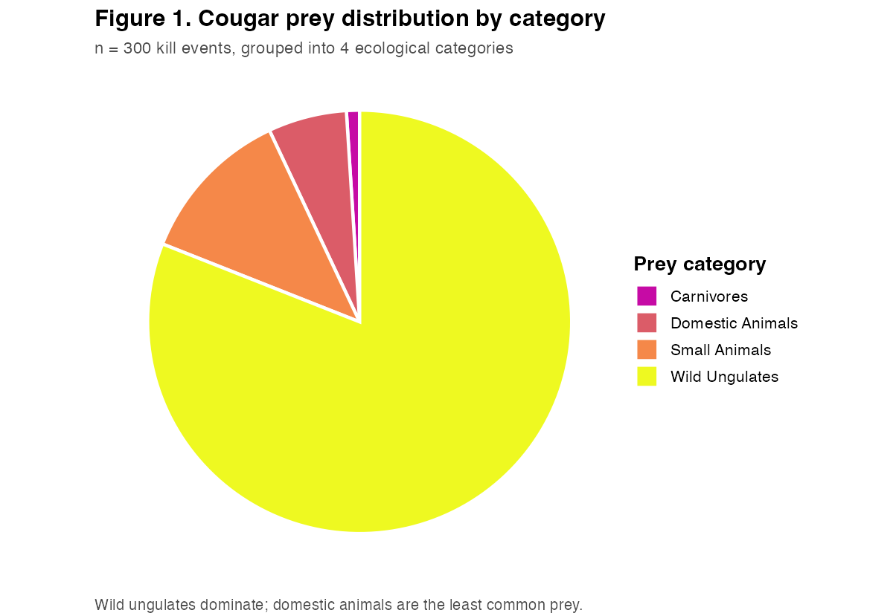
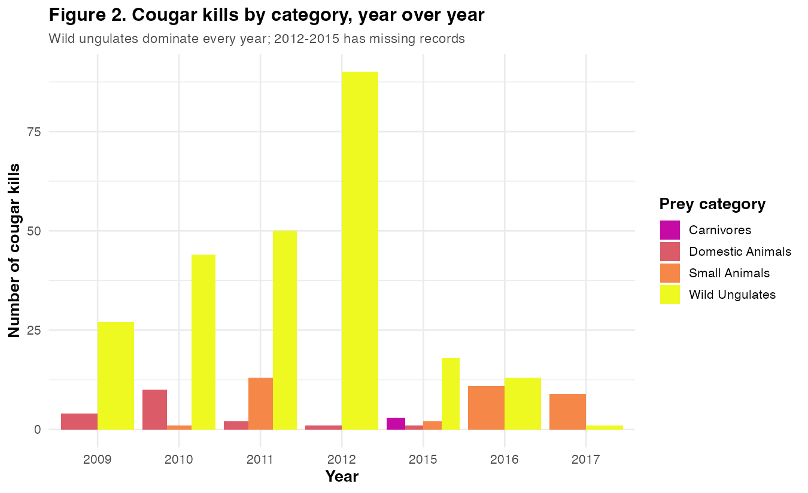
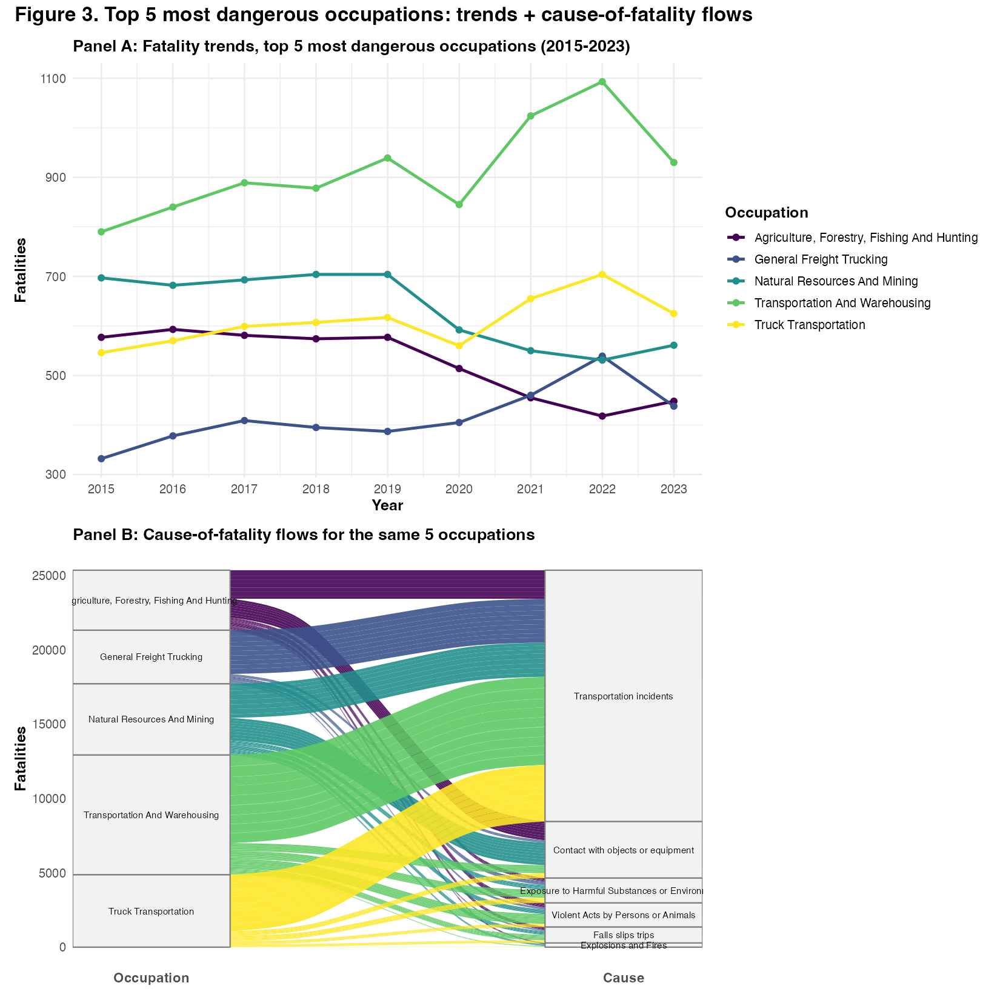
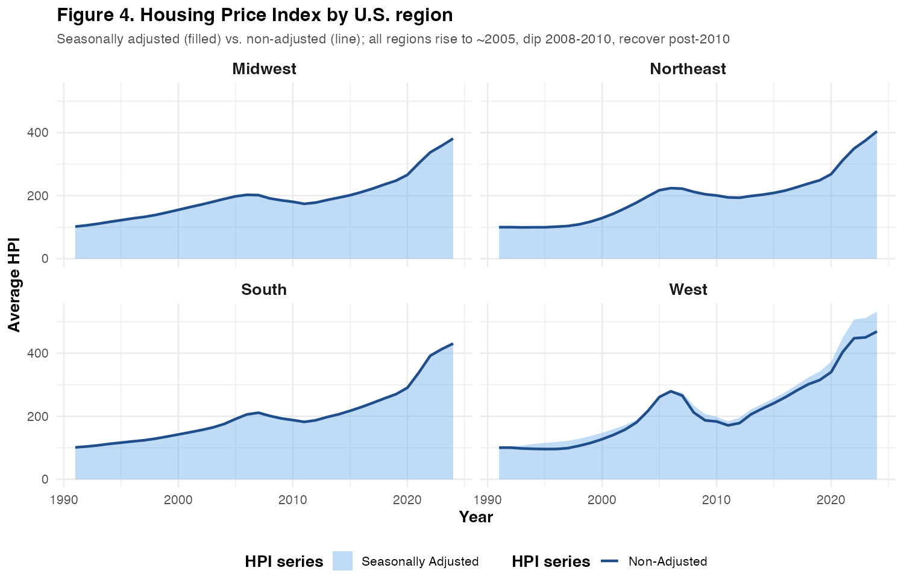

[← Back to R Analytics Projects](../README.md)

# Data Visualization Portfolio

[](./reports/MatthewThompson_Final_Portfolio.pdf)
[](https://arizona.edu)
[](https://r-project.org)
[](https://rmarkdown.rstudio.com)

> Course portfolio for INFO 526: R + ggplot2 across wildlife predation, occupational safety, and housing market data. University of Arizona.

**[View Complete Portfolio (PDF)](./reports/MatthewThompson_Final_Portfolio.pdf)** | **[Source (.Rmd)](./Final-Portfolio-Assignment.Rmd)**

---

## Project Overview

Final portfolio for INFO 526 (Data Visualization). Three datasets across different domains: cougar predation ecology (wildlife), occupational fatality records (safety), and the FHFA Housing Price Index (economic). The work emphasizes category-decision rationale and visual readability over chart variety.

**Key Metrics**: 3 domains • 6 visualizations across 4 numbered figures • 28MB largest dataset • 146K+ fatality records

---

## What I Applied

| Category | Techniques |
|---|---|
| **Plot types** | Pie, grouped bar, line, faceted area, alluvial (ggalluvial) |
| **Data wrangling** | dplyr categorical grouping, tidyr reshaping, lubridate dates |
| **Reproducibility** | RMarkdown source-to-PDF pipeline |
| **Custom tooling** | `data_dict()` helper for variable summaries (authored during exploration, not sourced by the final Rmd) |

**Tech stack**: R 4.x • RMarkdown • tidyverse (ggplot2, dplyr, lubridate, tidyr) • ggalluvial • ggstream • viridis • patchwork • gt • readxl • reshape2

---

## Dataset Summary

| Dataset | File | Size | Content |
|---|---|---:|---|
| Cougar Killsites | [`data/Cougar Killsites.xlsx`](./data/Cougar%20Killsites.xlsx) | 168KB | wildlife predation events, prey species + dates |
| Dangerous Jobs | [`data/Dangerous Jobs.csv`](./data/Dangerous%20Jobs.csv) | 28MB | 146K+ occupational fatality records, 2003-2023 |
| Housing Price Index | [`data/Housing Price Index.xlsx - Data.csv`](./data/Housing%20Price%20Index.xlsx%20-%20Data.csv) | 61KB | FHFA HPI, 4 U.S. regions, quarterly time series |

---

## Project Structure

```text
data-visualization-portfolio/
├── README.md                                       # Project documentation
├── Final-Portfolio-Assignment.Rmd                  # Reproducible source (43KB, 991 lines)
├── setup.R                                         # Installs the 9 required R packages + TinyTeX
├── Data Dictionary Function.R                      # Standalone EDA helper (not sourced by the Rmd)
├── Final Portfolio.Rproj                           # RStudio project file
├── Final_MinMaxHPI_Output.pdf                      # Build artifact regenerated by the Rmd
├── scripts/
│   └── export_readme_figures.R                     # Regenerates the 4 README PNGs from the same data
├── images/                                         # PNGs embedded in this README
│   ├── figure-1-cougar-prey-pie.png
│   ├── figure-2-cougar-kills-by-year.png
│   ├── figure-3-dangerous-jobs.png
│   └── figure-4-hpi-by-region.png
├── data/
│   ├── Cougar Killsites.xlsx                       # 168KB wildlife ecology
│   ├── Dangerous Jobs.csv                          # 28MB occupational safety (146K+ records)
│   └── Housing Price Index.xlsx - Data.csv         # 61KB economic indicators
└── reports/
    ├── MatthewThompson_Final_Portfolio.pdf         # Final rendered portfolio (399KB)
    └── Final-Portfolio-Assignment.pdf              # Assignment PDF version
```

---

## How to Reproduce

### View only

Open [`reports/MatthewThompson_Final_Portfolio.pdf`](./reports/MatthewThompson_Final_Portfolio.pdf) (399KB, all 4 figures).

### Knit from source

Requires R 4.x. RStudio recommended but not required.

```r
# 1. Install packages + TinyTeX (one-time, ~2 minutes)
source("setup.R")

# 2. From RStudio: open Final Portfolio.Rproj, then knit Final-Portfolio-Assignment.Rmd
# Or from the R console:
rmarkdown::render("Final-Portfolio-Assignment.Rmd", output_format = "pdf_document")
```

[`setup.R`](./setup.R) installs the 9 required packages and bootstraps TinyTeX (a minimal LaTeX distribution, ~150MB) if no system TeX is detected. PDF render takes ~30 seconds after setup.

### Regenerate the README figures

The 4 PNGs in `images/` are produced by [`scripts/export_readme_figures.R`](./scripts/export_readme_figures.R), which reads the same data files the Rmd uses and rebuilds each plot with thumbnail-readable styling (larger fonts, visible legends, on-chart titles). The Rmd itself is unchanged.

```r
Rscript scripts/export_readme_figures.R
```

Runs in ~2 seconds and overwrites the 4 PNGs in `images/`.

---

## Visualizations

### 1. Cougar Predation Ecology

**Plots**: Pie chart (prey distribution) and grouped bar chart (temporal trends).

I grouped 30+ prey species into 4 ecological categories (Wild Ungulates, Small Animals, Domestic Animals, Carnivores) to avoid overlapping classifications.





Findings:
- Wild ungulates (mule deer, bighorn sheep, pronghorn) are primary prey
- Domestic animals are the least common prey category
- Data gaps between 2012-2015
- Zero domestic animal kills recorded in 2016

### 2. Occupational Safety Analysis

**Plots**: Line graph (temporal trends) and alluvial diagram (cause-occupation flows).

I started with a proportional stream plot but switched to a line graph because stream plots hide absolute counts behind percentage shifts. The alluvial diagram (ggalluvial) shows how fatality causes map to the 5 most-dangerous occupations.



Findings:
- Transportation and mining are the most dangerous occupations
- Truck-related jobs (general freight, transportation & warehousing) trended up until a sharp 2023 drop
- Transportation incidents are the most common cause of fatality across the top 5 dangerous jobs; explosions and fires are the least common

### 3. Housing Price Index Trends

**Plots**: Faceted area plots (regional comparison) and a `gt` summary table.



Findings:
- Midwest, Northeast, South show similar HPI trajectories
- West region has higher volatility
- All regions: increase to ~2005, decline through 2008-2010, recovery after 2010

---

## Challenges Solved

### Category decisions over chart variety

Most of my course feedback was about category choices: which to group, which to drop. My tendency is to include too much in one view. For this portfolio I grouped 30+ prey species into 4 ecological categories without overlap, and dropped weight class from the grouped bar chart because reading the bars plus a weight-class overlay would be too dense.

### Stacked plots vs absolute comparison

I had started with a stacked bar chart over 10+ categories. Readers cannot accurately compare stacked values, so I switched to a grouped bar chart with fewer categories. For the most-dangerous-jobs question I used a line graph rather than a proportional stream graph, because the stream plot hides actual fatality counts behind percentage shifts.

### Alluvial diagram label readability

I built an alluvial diagram for cause-of-fatality flows. Text aesthetics were hard to read at default sizes. I considered replacing labels with a legend, but legends do not communicate where the flow starts. I kept the inline text labels and explained the diagram briefly in the caption.

### Pie-slice label placement

Course feedback suggested moving the legend labels into each pie slice. I got them only partially aligned and judged the external legend cleaner and less error-prone for this data, so I kept it. A readability call, not a blocker.

---

## Academic Information

**Course**: INFO 526, Data Visualization
**Term**: 2024-2025
**Institution**: University of Arizona

---

<p align="center">
  <em>University of Arizona, Data Science Portfolio</em>
</p>
